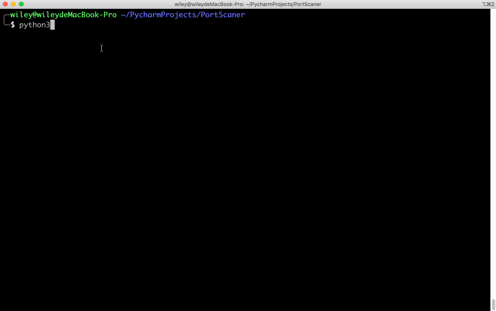
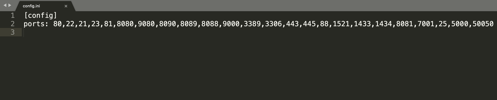

<h1 align="center"> Welcome to PortScanner 🎉 </h1>

> 平平无奇的端口扫描工具，方便渗透测试人员针对自己常见端口快速扫描，淦就完了 🔨

## 📌 Demo



快速针对渗透测试人员日常渗透端口扫描

## 📌 设置扫描端口



需要增加扫描端口可直接在此添加

## 🚀 如何使用

还是要啰嗦一句如何使用 🎈

### 安装所需Python库

```bash
pip3 install -r requirements.txt
```

### 脚本运行


```bash
python3 PortScanner.py -i 192.168.1.1
```

脚本使用Python3开发，请使用Python3环境运行


## 声明

本脚本只用于渗透测试人员对授权IP进行端口扫描，如若使用该脚本从事非法网络安全扫描，后果自负！！！

脚本不能与强大的Nmap端口扫描神器相比，只是个人渗透测试中需要开发的此脚本。

该脚本源于在校期间CTF比赛所用，现进行优化...